# XERO Coding Exercise

## SwiftUI-MVVM
A project that uses SwiftUI and swift 5.5, MVVM for software architecture.

## New swift(swift 5.5) features used
- Async/await
- Actors(@MainActor)

## Compatibility
- Xcode 13.2
- iOS 16 and later(NavigationStack)
- SwiftUI 3
- Swift 5.5

## Project overview
/*
 Welcome to the Xero technical excercise!
 ---------------------------------------------------------------------------------
 The test consists of a small invoice application that has a number of issues.
 
 Your job is to fix them and make sure you can perform the functions in each method below and display the list of invoices from getInvoices() inside a UITableView.
 
 Note your first job is to get the solution compiling!
 
 Rules
 ---------------------------------------------------------------------------------
 * The entire solution must be written in Swift (UIKit or SwiftUI)
 * You can modify any of the code in this solution, split out classes, add projects etc
 * You can modify Invoice and InvoiceLine, rename and add methods, change property types (hint)
 * Feel free to use any libraries or frameworks you like
 * Feel free to write tests (hint)
 * Show off your skills!
 
 Good luck :)
 
 When you have finished the solution please zip it up and email it back to the recruiter or developer who sent it to you
 */

## Screens 
 ---------------------------------------------------------------------------------
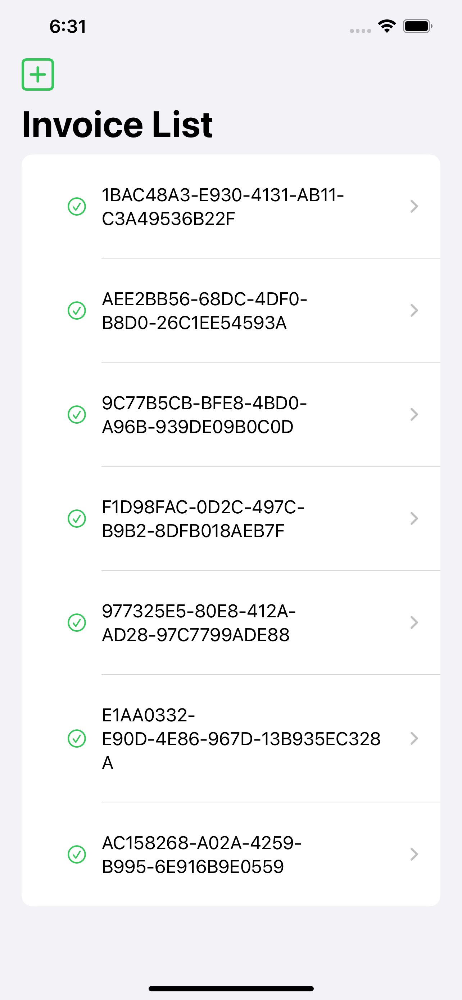 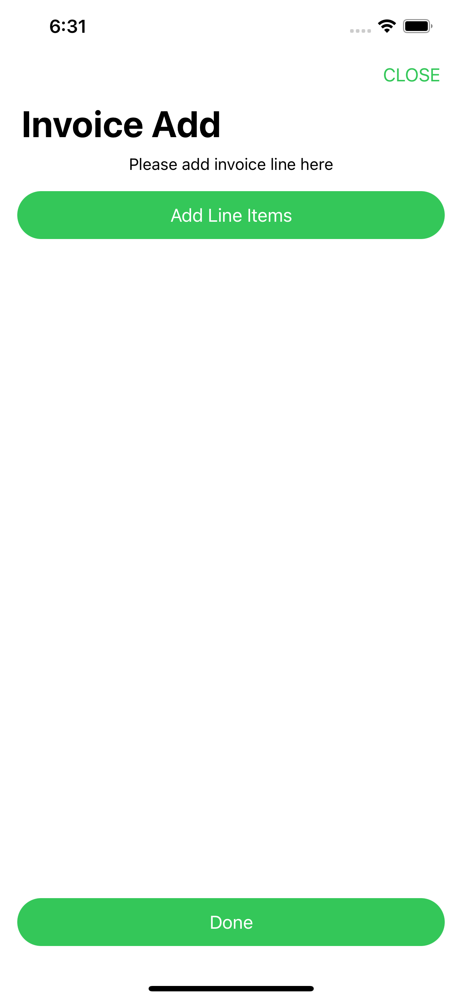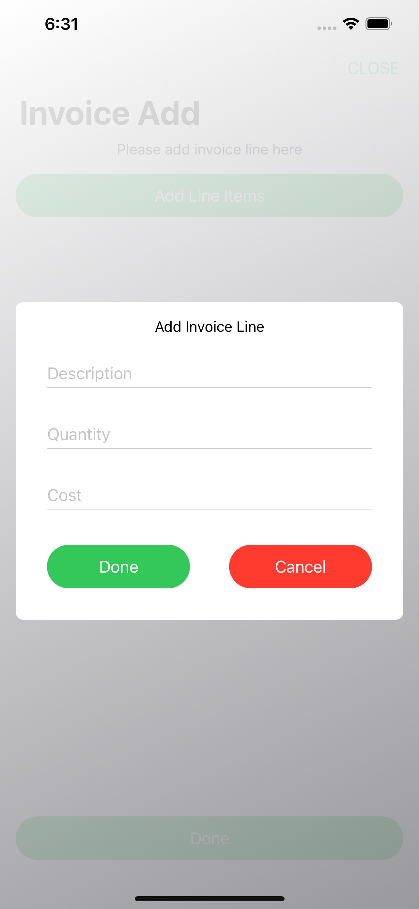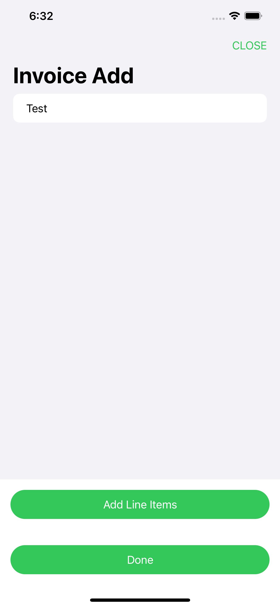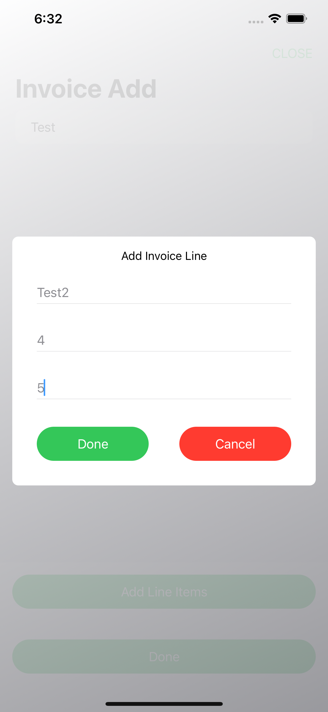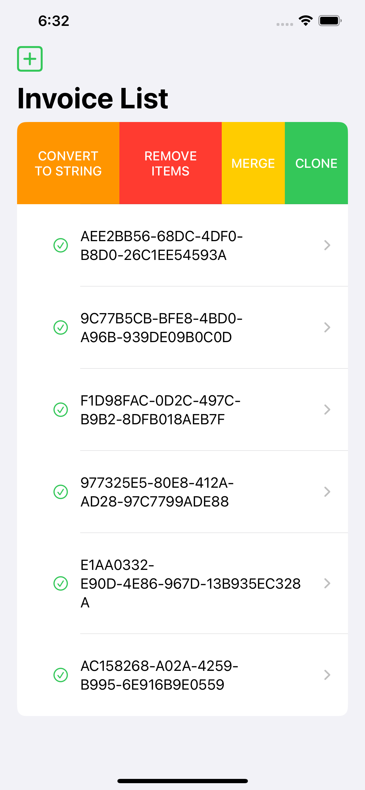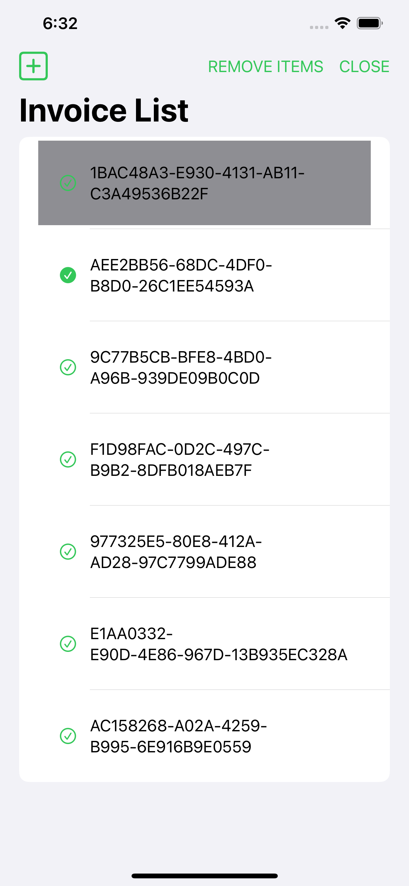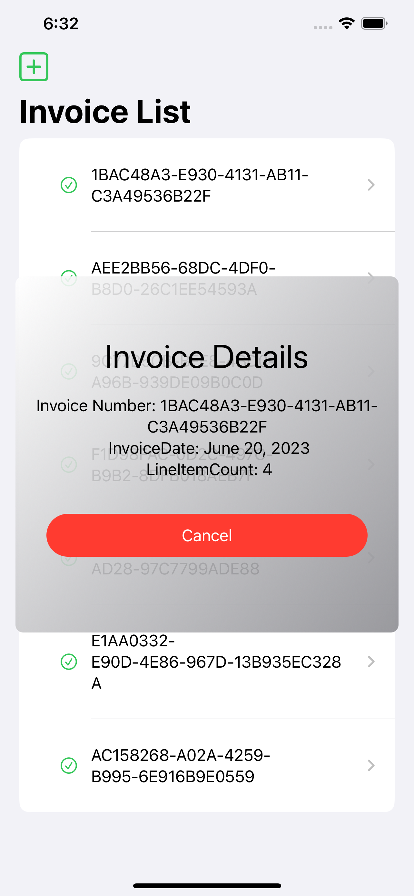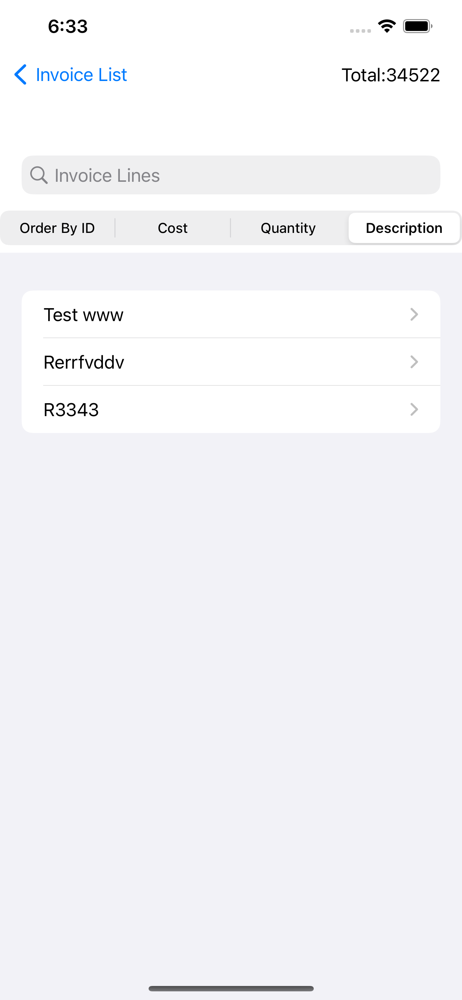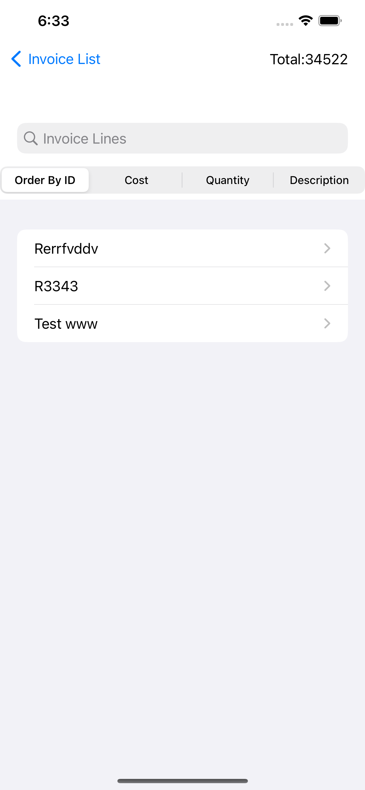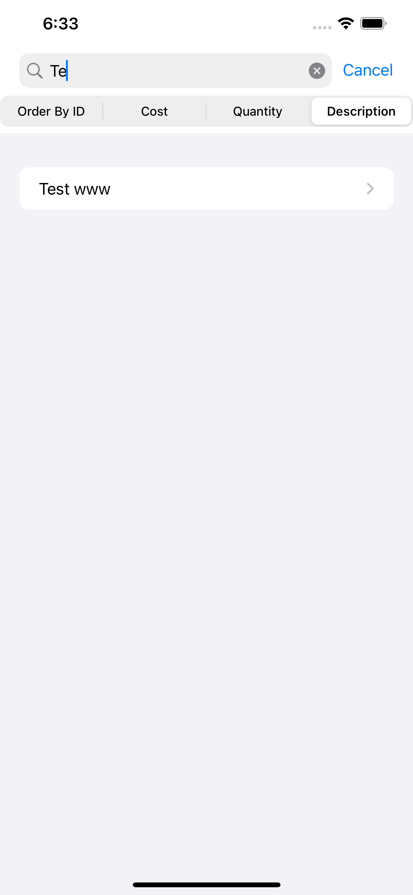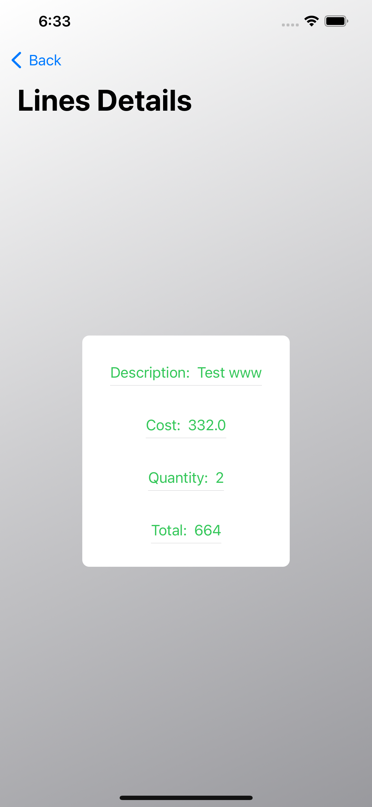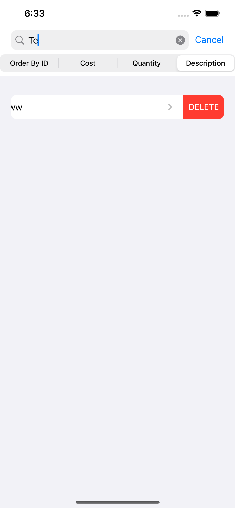
 ---------------------------------------------------------------------------------

## What you can find in this project
 ### Home screen :
- Adding the new invoice.
- Creating an action for invoice(Clone, Merege, Remove Item, View Details)

 ### Create Invoice screen :
 - Showing invoiceLine list(Can't edit)
 - Adding form
 
  ### Show InvoiceLine screen :
 - Showing total for all items
 - filters by(ID/cost/quantity/description) Note: cost & quantity has a generic function for fileter max values 
 
   ### Line Details screen :
   
- Showing all details with tatal(Quantity*cost)

## Libraries/Frameworks(swift package manager)
- Realm
- RealmDatabase

 ### Unit test : covered(60.5%)
- functional testing covered

- Automation UI testing - covered(20%)

## Project Folder structure
 ---------------------------------------------------------------------------------
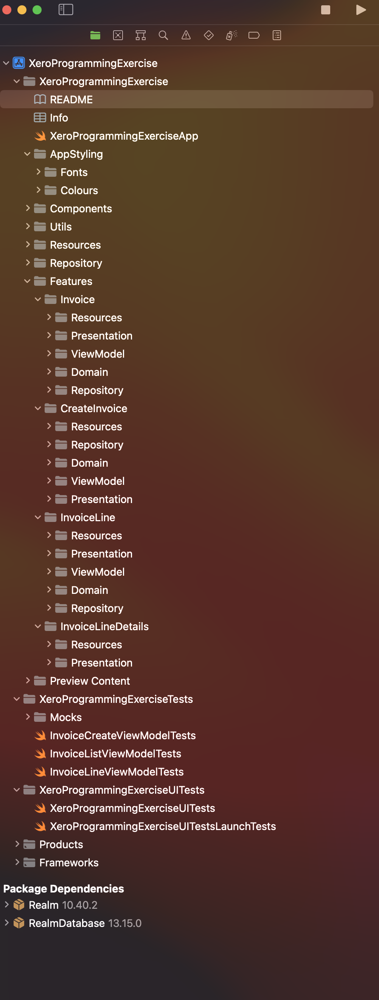
 ---------------------------------------------------------------------------------

## License
Copyright tdmihiran@gmail.com,  Licensed under the MIT license.
